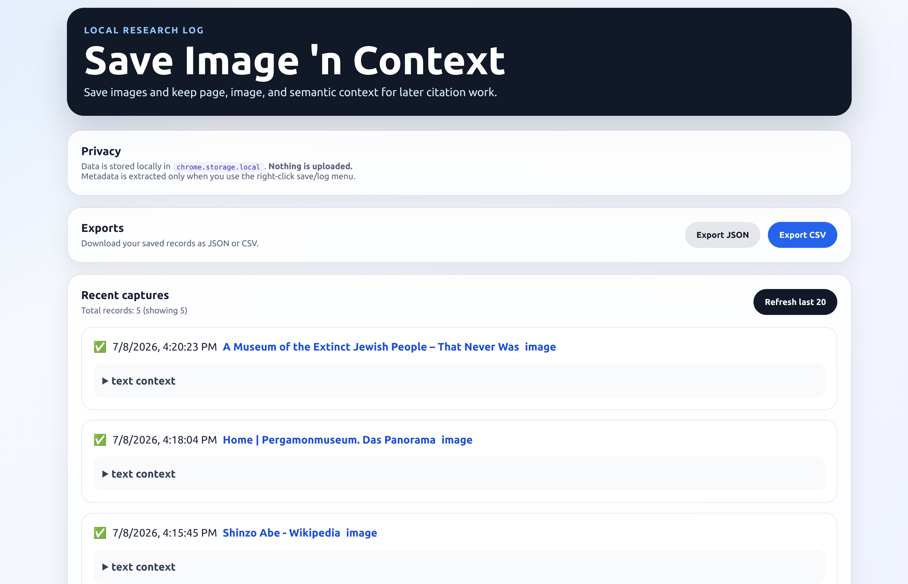

# Image Source Saver Chrome Extension



A step-by-step learning project documenting the development of a Chrome Manifest V3 extension for researchers who collect images from the web and want to preserve both the image and its source information.

The project evolves over multiple milestones, beginning with a simple context-menu extension and gradually adding metadata extraction, local storage, semantic context capture, and a polished user interface.

> **Note**
>
> This repository documents the development process. The production-ready extension intended for the Chrome Web Store will live in a separate repository.

---

## Project Goals

The extension allows a researcher to:

- Save an image from any webpage.
- Capture where the image came from.
- Preserve citation-style metadata.
- Capture semantic context surrounding the image.
- Store everything locally.
- Export collected records for later research.

No cloud services are used.

---

# Development Timeline

| Day | Focus |
|------|------|
| **Day 1** | Context menu and image download |
| **Day 2** | Content scripts and metadata extraction |
| **Day 3** | Local storage, JSON export, CSV export |
| **Day 4** | Robustness improvements, retries, duplicate detection, UX |
| **Day 5** | Semantic metadata extraction, polished options page |

Each day's work is preserved in its own folder.

---

# Repository Structure

```text
.
├── day1-contextmenu/
├── day2-content-script/
├── day3-log-locally/
├── day4-robustness-UX/
├── day5-semantic-upgrade-layer/
└── README.md
```

The latest implementation is located in:

```text
day5-semantic-upgrade-layer/
```

---

# Features (Day 5)

## Image metadata

- image URL
- alt text
- title
- aria-label
- figure caption
- referrer policy

## Page metadata

- page URL
- page title
- canonical URL
- hostname
- meta description
- Open Graph title
- Open Graph description

## Semantic context

- nearest heading
- nearest paragraph
- linked image URL
- linked image text

## Reliability

- automatic content-script injection
- retry messaging
- duplicate detection
- fallback logging
- success/warning badge feedback

## Local storage

- stores up to **5,000** records
- data stored in `chrome.storage.local`
- JSON export
- CSV export
- recent log viewer

---

# Example Record

```json
{
  "pageTitle": "...",
  "pageUrl": "...",
  "canonicalUrl": "...",

  "imageUrl": "...",
  "alt": "...",
  "caption": "...",

  "hostname": "...",
  "metaDescription": "...",
  "ogTitle": "...",
  "ogDescription": "...",

  "nearestHeading": "...",
  "nearestParagraph": "...",

  "linkedHref": "...",
  "linkedText": "..."
}
```

---

# Privacy

All citation records are stored locally using Chrome's local storage.

No information is uploaded to external servers.

Metadata is extracted only after the user explicitly chooses the context-menu command.

---

# Running the Latest Version

1. Clone the repository.

```bash
git clone https://github.com/nina-mir/image-source-saver-chrome-extension.git
```

2. Open Chrome.

3. Visit:

```text
chrome://extensions
```

4. Enable **Developer Mode**.

5. Click **Load unpacked**.

6. Select:

```text
day5-semantic-upgrade-layer/
```

7. Reload the extension after making changes.

---

# Current Limitations

- Metadata quality depends on the source website.
- CSS background images are not supported.
- Semantic extraction uses deterministic DOM heuristics.
- Records are local to the current Chrome profile.

---

# Future Work

- Search and filtering
- Editable notes
- Thumbnail previews
- Cloud synchronization (optional)
- Browser Store release
- Citation export formats (APA, MLA, Chicago)

---

# License

A license has not yet been selected.
